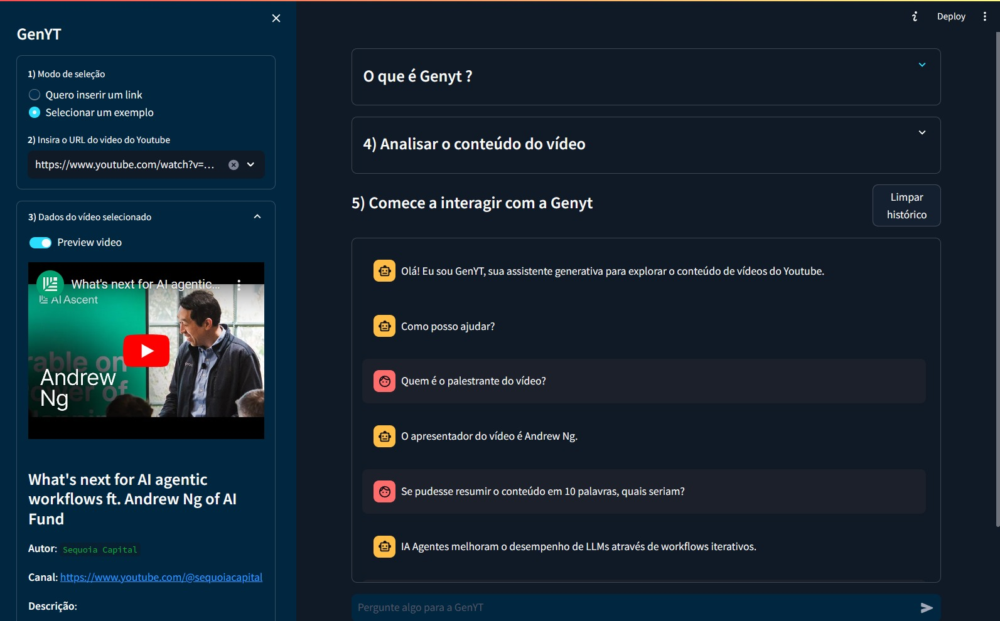

# GentYT

## O que é?
GenYT é uma assistente inteligente com o poder de combinar o LLM generativo do Google GeminiAI com vídeos do YouTube para oferecer uma experiência de aprendizado imersiva e interativa.

Ela não só permite assistir, ouvir ou ler o conteúdo do vídeo, mas interagir com o Gemini para fazer perguntas personalizadas.

## Como utilizar?

Clone o repositório:

`git clone https://github.com/lipipds/genyt.git`

Instale as dependências:

`cd genyt`

`pip install -r requirements.txt`

Insira seu API Token do Gemini AI no arquivo env.py. Verifique [aqui](https://aistudio.google.com/app/apikey):

Rode uma instancia local da aplicação:

`streamlit run app.py`

